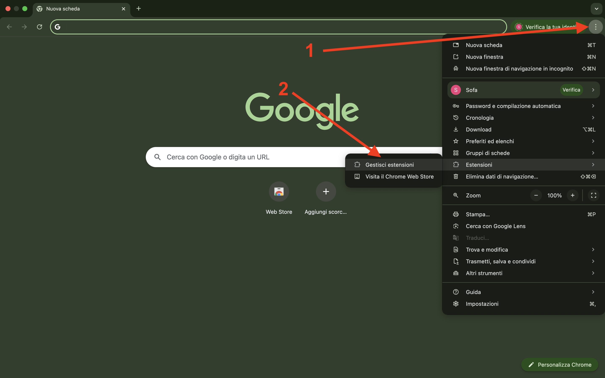
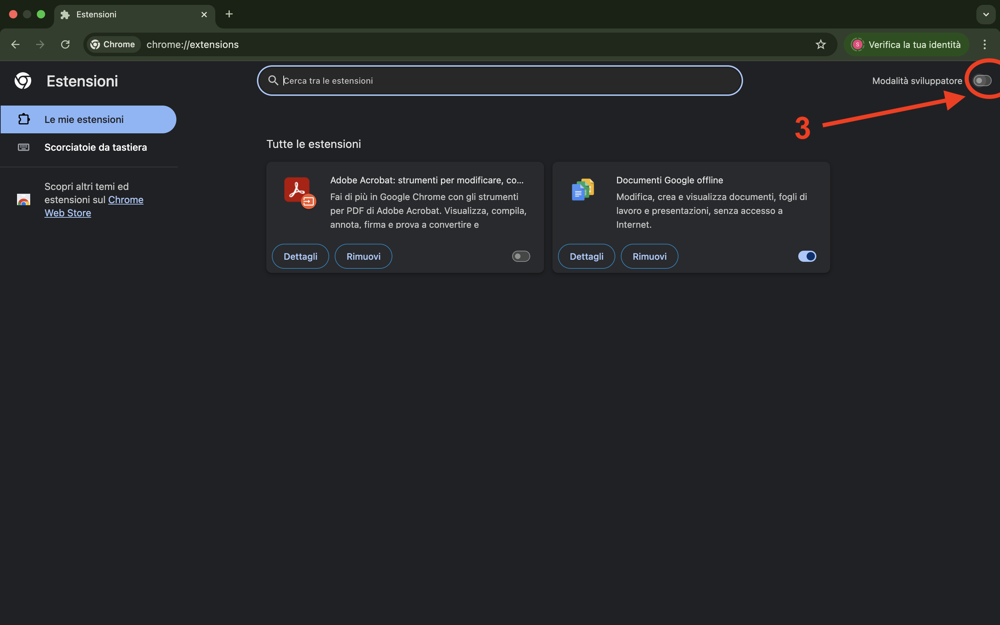
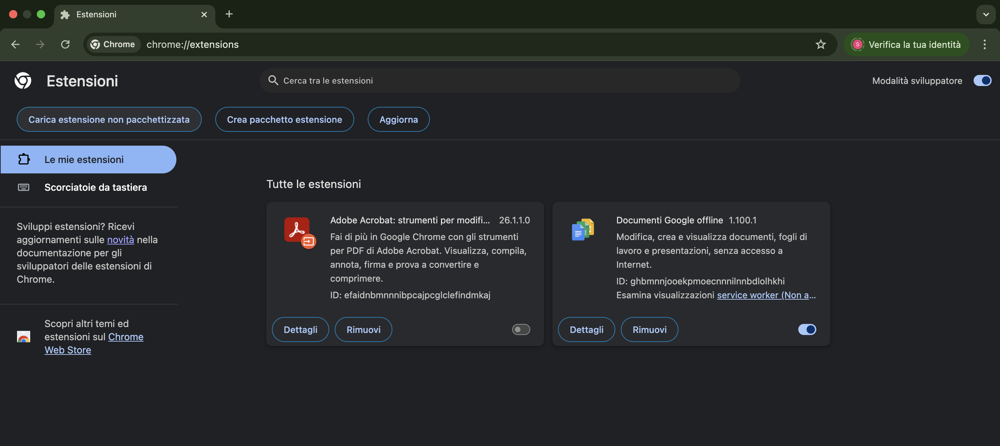
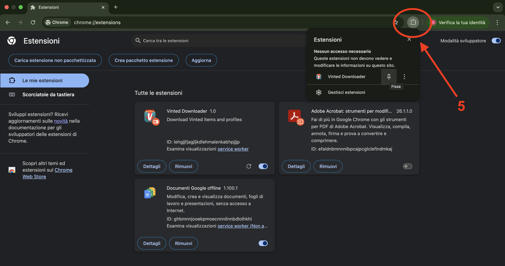

# Vinted Downloader – Chrome Extension

## Installation

1. Clone the repository:
   ```bash
   git clone https://github.com/im-sofaking/Vinted-Downloader
   ```
2. Open Google Chrome.
3. Go to:

   Chrome → Extensions → Manage Extensions
   
   Or visit:
   
   chrome://extensions/

4. Enable Developer mode (top right)

5. Click on Load unpacked

6. Select the Vinted-Downloader folder you just cloned

The extension will now appear in the Chrome extensions list

## Screenshot





